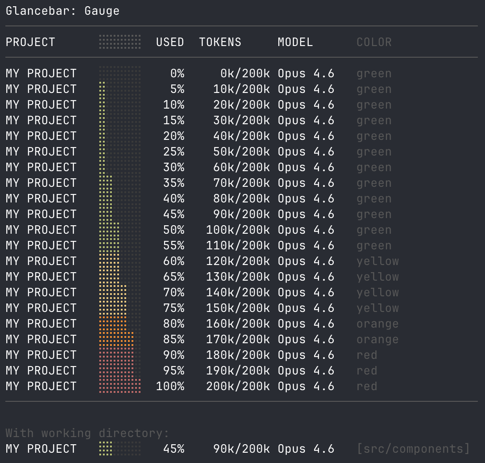

# Glancebar

Glanceable statusline themes for Claude Code.



## Styles

### Gauge

A braille-block meter that fills up as context is consumed. Color shifts from green → yellow → orange → red as you run low.

```
MY PROJECT  ⣿⣿⠀⠀⠀⠀ 30% 60k/200k Opus 4.6
MY PROJECT  ⣿⣿⣿⣿⣿⠀ 85% 170k/200k Opus 4.6  [src/components]
```

**What it shows:**
- Project folder (uppercase)
- 6-block context meter with 4-stage color coding
- Percent used + token count / max
- Model name
- Working directory (only when different from project root)

**Install:**

```bash
# Download the style and configure Claude Code
mkdir -p ~/.claude/scripts && curl -sL https://raw.githubusercontent.com/cornellnoel/glancebar/main/styles/gauge.sh -o ~/.claude/scripts/statusline.sh && echo '✓ Downloaded! Now add this to ~/.claude/settings.json:' && echo '  "statusLine": { "type": "command", "command": "bash ~/.claude/scripts/statusline.sh" }'
```

Or paste this into Claude Code:

```
Download https://raw.githubusercontent.com/cornellnoel/glancebar/main/styles/gauge.sh to ~/.claude/scripts/statusline.sh and update my ~/.claude/settings.json to set statusLine to {"type":"command","command":"bash ~/.claude/scripts/statusline.sh"}
```

Changes take effect on your next message — no restart needed.

## Color Thresholds

| Context remaining | Color  | Meaning              |
|-------------------|--------|----------------------|
| > 40%             | Green  | You're fine           |
| 20–40%            | Yellow | Heads up              |
| 10–20%            | Orange | Start wrapping up     |
| < 10%             | Red    | Almost out of context |

Based on HCI research on pre-attentive processing and platform conventions (Apple, Android, Windows all use ~20% as their critical battery threshold). See [DESIGN.md](DESIGN.md) for the full rationale.

## Colorblind-Safe Version

A variant using blue → cyan → yellow → magenta instead of green → red. Fully distinguishable with red-green color deficiency (~8% of men).

| Context remaining | Color   | Meaning              |
|-------------------|---------|----------------------|
| > 40%             | Blue    | You're fine           |
| 20–40%            | Cyan    | Heads up              |
| 10–20%            | Yellow  | Start wrapping up     |
| < 10%             | Magenta | Almost out of context |

**Install:**

```bash
# Download the colorblind-safe version
mkdir -p ~/.claude/scripts && curl -sL https://raw.githubusercontent.com/cornellnoel/glancebar/main/styles/gauge-colorblind.sh -o ~/.claude/scripts/statusline.sh && echo '✓ Downloaded! Now add this to ~/.claude/settings.json:' && echo '  "statusLine": { "type": "command", "command": "bash ~/.claude/scripts/statusline.sh" }'
```

Or paste this into Claude Code:

```
Download https://raw.githubusercontent.com/cornellnoel/glancebar/main/styles/gauge-colorblind.sh to ~/.claude/scripts/statusline.sh and update my ~/.claude/settings.json to set statusLine to {"type":"command","command":"bash ~/.claude/scripts/statusline.sh"}
```

## Preview

Run the preview script to see all styles with live colors in your terminal:

```bash
bash preview/preview.sh
```

## Performance

Zero impact. The statusline script runs locally — no API calls, no network requests, no extra tokens consumed. It's a small shell script that parses a JSON blob with `jq` after each assistant message, debounced at 300ms. If a new update triggers while the previous one is still running, the old one is cancelled. Total execution time is under 10ms.

## Requirements

- Claude Code with statusline support
- [`jq`](https://jqlang.github.io/jq/) — a lightweight command-line JSON processor (included with most systems, or `brew install jq`)

## License

MIT
